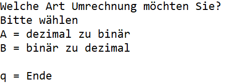
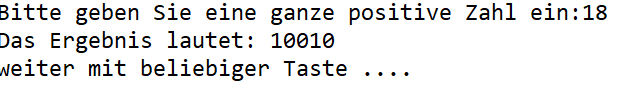
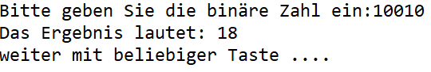

Erstellen Sie ein C# Konsolen-Projekt, welches Zahlen wahlweise von dezimal nach binär oder von binär nach dezimal umrechnet.

Schreiben Sie für jede Umrechnung eine eigene Funktion / Methode mit den folgenden Signaturen:

DecToBin(int input):string;

BinToDec(string input):decimal;

Versehen Sie das Programm mit einem Menü, welches dem Benutzer die Auswahl anbietet, welche Umrechnung ausgeführt werden soll. Anschließend soll er entweder eine positive ganze Zahl eigeben können (DecToBin) oder eine binäre Zahl eingeben (BinToDec).

Solange der Benutzer nicht "q" eingibt, startet das Programm erneut.

Bspl: Menü

Bspl: Ein- & Ausgabe Dezimal zu Binär

Bspl: Ein- & Ausgabe Binär zu Dezimal

Entwickeln Sie eigene Ideen zur Umsetzung des Problems. Die Ausgabe an der Konsole erfolgt ohne spezielle Formatangaben, es werden die Rückgabewerte der Funktionen / Methoden ausgegeben.
